# GTM Strategy Optimizer — OpenEnv Environment

### Reinforcement Learning for Go-To-Market Strategy Optimization

<br>


---

## Overview

This repository contains an **OpenEnv-compatible reinforcement learning environment** for optimizing **Go-To-Market (GTM) strategies** for product launches.

The environment formulates GTM strategy as a **sequential decision-making problem**, where an agent continuously learns how to:

- Allocate marketing budgets
- Target customer segments
- Optimize product messaging
- Run market experiments
- Adjust pricing
- Respond to changing market conditions

The objective is to maximize **revenue and overall business performance** while accounting for uncertainty, diminishing returns, customer behavior, competitive response, and long-term brand health.

The repository also includes an interactive Hugging Face Space with a dashboard available at `/web/`. The dashboard evaluates and compares a **trained PPO policy**, an **equal-allocation heuristic**, and a **uniform random agent** on the same task and seed.

---

## Motivation

Go-To-Market strategy involves a continuous sequence of interconnected decisions.

A strategy that performs well in one week may become less effective as:

- Marketing channels saturate
- Customer behavior changes
- Competitors respond
- Market conditions shift
- Brand effects accumulate
- Pricing changes influence demand

Instead of treating GTM as a one-time optimization problem, this environment models it as a **closed-loop sequential decision-making process**.

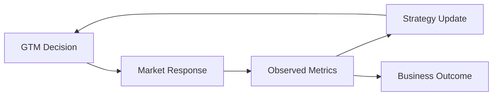

The agent repeatedly observes the environment, evaluates the resulting market response, and adapts its strategy.

---

## Environment Formulation

The GTM environment can be formulated as a sequential decision-making process:

$$
\mathcal{E} = (\mathcal{S}, \mathcal{A}, P, R, \gamma)
$$

where:

| Symbol | Description |
|---|---|
| $\mathcal{S}$ | GTM environment state space |
| $\mathcal{A}$ | Available GTM action space |
| $P$ | Environment transition dynamics |
| $R$ | Reward function |
| $\gamma$ | Discount factor |

At timestep $t$, the agent observes the current state:

$$
s_t \in \mathcal{S}
$$

and selects an action:

$$
a_t \in \mathcal{A}
$$

The environment then transitions to the next state according to:

$$
s_{t+1} \sim P\left(s_{t+1} \mid s_t, a_t\right)
$$

The corresponding reward is:

$$
r_t = R\left(s_t, a_t, s_{t+1}\right)
$$

The policy $\pi$ seeks to maximize the expected discounted return:

J(\pi)
=
\mathbb{E}_{\pi}
\left[
\sum_{t=0}^{T-1}
\gamma^t r_t
\right]

---

## Environment Architecture

The environment combines GTM decision-making, market simulation, customer behavior, business metrics, and reinforcement learning.

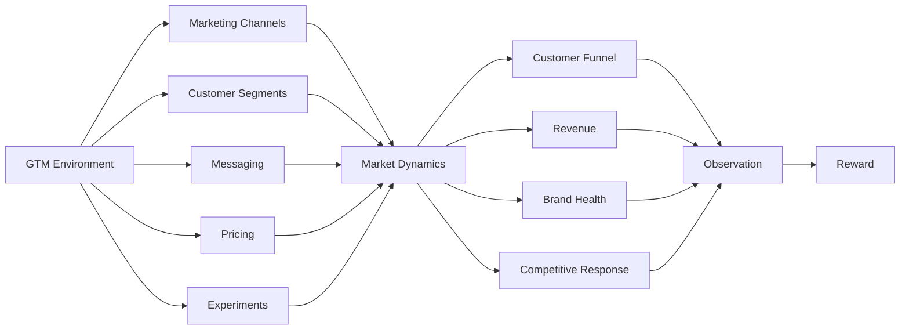

---

## Action Space

Each timestep represents **one week** of GTM activity.

At every timestep, the agent selects a GTM strategy consisting of multiple coordinated actions.

### Action Definition

| Action | Type | Description |
|---|---|---|
| `budget_allocation` | `dict[str, float]` | Fraction of weekly budget allocated to each marketing channel |
| `segment_targeting` | `dict[str, float]` | Targeting weight assigned to each customer segment |
| `messaging` | `dict[str, float]` | Emphasis assigned to each messaging dimension |
| `experiment` | `str \| null` | Optional experiment to launch |
| `pricing_action` | `str \| null` | Optional pricing adjustment |

### Budget Allocation

The agent distributes the available weekly budget across marketing channels.

The allocation constraint is:

$$
\sum_{c=1}^{C} b_c \leq 1
$$

where $b_c$ represents the fraction of the weekly budget allocated to channel $c$.

### Segment Targeting

The agent assigns targeting weights to different customer segments.

The targeting distribution approximately satisfies:

$$
\sum_{s=1}^{S} w_s \approx 1
$$

where $w_s$ represents the targeting weight assigned to customer segment $s$.

### Messaging

The agent selects a weighted messaging strategy across different messaging dimensions.

The messaging distribution approximately satisfies:

$$
\sum_{m=1}^{M} q_m \approx 1
$$

where $q_m$ represents the emphasis assigned to messaging dimension $m$.

---

## Messaging Dimensions

The environment supports the following messaging dimensions:

| Dimension | Description |
|---|---|
| `cost_savings` | Emphasis on economic value and cost reduction |
| `performance` | Emphasis on product performance |
| `reliability` | Emphasis on consistency and dependability |
| `innovation` | Emphasis on innovation and technological differentiation |
| `ease_of_use` | Emphasis on usability and simplicity |
| `security` | Emphasis on safety and security |

---

## Observation Space

The environment provides observations describing the current state of the GTM simulation.

| Field | Type | Description |
|---|---|---|
| `week` / `total_weeks` | `int` | Current week and total episode length |
| `budget_remaining` | `float` | Remaining marketing budget |
| `channel_metrics` | `dict` | Channel-level impressions, clicks, conversions, spend, CTR, CVR, and ROI |
| `funnel` | `dict` | Visitors, signups, activations, retained users, and conversion rates |
| `segment_performance` | `dict` | Segment-level conversion rate, engagement, churn, and revenue |
| `experiment_result` | `dict \| null` | Result of a completed experiment |
| `brand_score` | `float` | Noisy proxy for brand health on a 0–100 scale |
| `total_revenue` | `float` | Cumulative revenue |
| `message` | `str` | Human-readable environment summary |

---

## GTM Funnel

Customer acquisition is modeled using a multi-stage funnel.

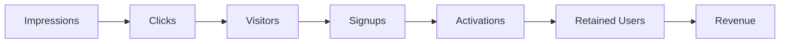

The environment tracks metrics throughout the funnel, including:

- Impressions
- Clicks
- Visitors
- Signups
- Activations
- Retention
- Conversions
- Revenue
- ROI

---

## GTM Decision Loop

The agent operates through a continuous weekly decision cycle.

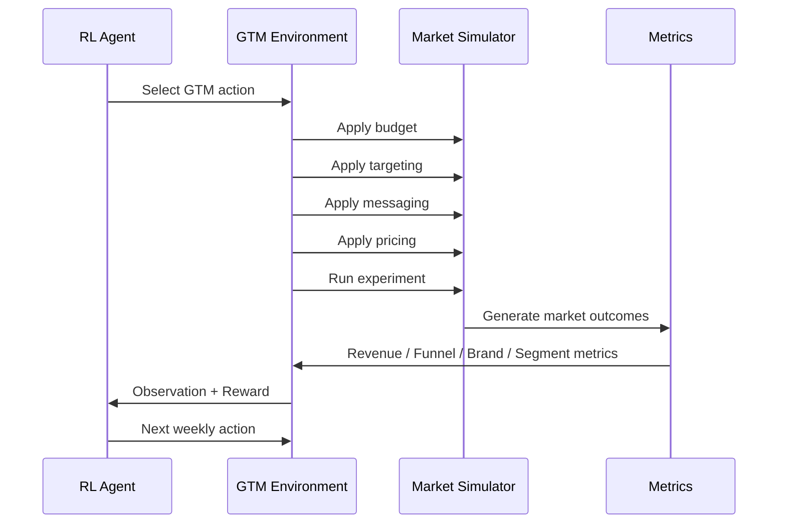

---

## Environment Dynamics

The environment incorporates several dynamics designed to represent uncertainty and feedback loops present in real-world GTM strategy.

### Diminishing Returns

Marketing channels exhibit diminishing returns as cumulative spending increases.

A simplified representation is:

$$
E_c(S_c) = E_{c,0} f(S_c)
$$

where:

- $E_c(S_c)$ is the effectiveness of channel $c$ after cumulative spend $S_c$
- $E_{c,0}$ is the baseline effectiveness of channel $c$
- $S_c$ is cumulative spend on channel $c$
- $f(\cdot)$ is a diminishing-return function

This prevents an agent from continuously concentrating its entire budget on a single channel.

### Brand Evolution

Brand health evolves over time based on messaging consistency and brand investment.

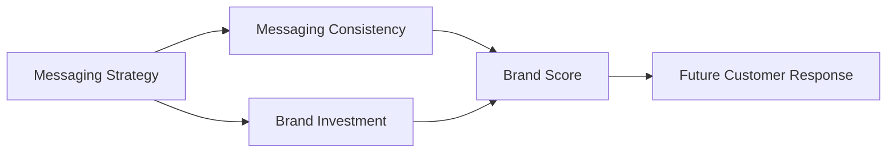

Brand effects are delayed and may influence future customer behavior rather than producing an immediate revenue response.

### Noisy Observations

The environment introduces stochasticity into observed performance metrics.

An observed metric can be represented as:

$$
\tilde{x} = x + \epsilon
$$

where:

- $x$ is the underlying metric
- $\tilde{x}$ is the observed metric
- $\epsilon$ represents observation noise

The magnitude of noise increases with environment difficulty.

This requires agents to make decisions under uncertainty rather than relying on perfectly observed market metrics.

### Delayed Effects

Some GTM decisions produce effects over multiple timesteps.

Examples include:

- Brand investment
- Messaging changes
- Customer retention
- Experiments
- Pricing changes

Consequently, an action should be evaluated not only by its immediate effect but also by its potential impact on future states.

### Competitor Response

The `market_dominator` task introduces an active competitor.

When the agent performs strongly, competitive aggression can increase.

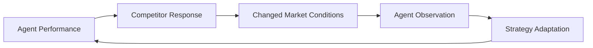

This introduces an additional strategic feedback loop into the environment.

### Market Regime Shifts

The `market_dominator` task introduces demand shocks at approximately:

- Week 12
- Week 24

The agent must adapt its GTM strategy as market conditions change.

---

## Task Suite

The environment contains three progressively more complex GTM tasks.

| Task | Difficulty | Weeks | Channels | Segments | Features |
|---|---|---:|---:|---:|---|
| `channel_optimizer` | Easy | 12 | 3 | 2 | Budget + targeting |
| `growth_strategist` | Medium | 24 | 5 | 3 | Experiments + pricing + brand management |
| `market_dominator` | Hard | 36 | 7 | 4 | Active competitor + market regime shifts + compliance traps |

---

## Task Progression

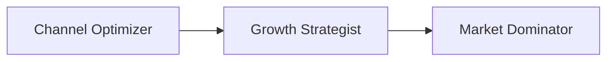

### Channel Optimizer

The `channel_optimizer` task focuses on fundamental GTM allocation decisions.

Primary components include:

- Marketing budget allocation
- Channel selection
- Customer targeting

The episode lasts:

$$
T = 12
$$

weeks.

### Growth Strategist

The `growth_strategist` task introduces additional strategic decisions.

Components include:

- Multiple marketing channels
- Customer segmentation
- Experimentation
- Pricing
- Brand management

The episode lasts:

$$
T = 24
$$

weeks.

### Market Dominator

The `market_dominator` task represents the most complex environment.

Additional dynamics include:

- Active competitor
- Market regime shifts
- More marketing channels
- More customer segments
- Compliance traps

The episode lasts:

$$
T = 36
$$

weeks.

---

## Reward Function

The environment evaluates GTM decisions using multiple business-performance signals.

Relevant components include:

- Revenue
- Customer acquisition
- Conversion
- Retention
- Brand health
- Marketing efficiency

A generalized reward formulation can be expressed as:

$$
R_t =
\alpha R_{\mathrm{revenue}}
+
\beta R_{\mathrm{growth}}
+
\gamma R_{\mathrm{brand}}
-
\delta C_{\mathrm{inefficiency}}
$$

where:

| Component | Description |
|---|---|
| $R_{\mathrm{revenue}}$ | Revenue contribution |
| $R_{\mathrm{growth}}$ | Customer and funnel growth contribution |
| $R_{\mathrm{brand}}$ | Brand-health contribution |
| $C_{\mathrm{inefficiency}}$ | Cost associated with inefficient decisions |
| $\alpha$ | Revenue weighting coefficient |
| $\beta$ | Growth weighting coefficient |
| $\gamma$ | Brand weighting coefficient |
| $\delta$ | Inefficiency penalty coefficient |

The exact implementation of the reward is defined by the environment.

---

## Reinforcement Learning

The repository contains a lightweight custom **Proximal Policy Optimization (PPO)** implementation.

The PPO agent uses an actor-critic architecture.

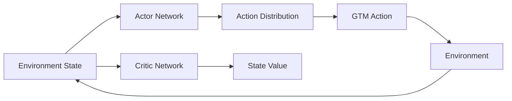

The **actor** learns the GTM decision policy.

The **critic** estimates the value of the current environment state.

---

## PPO Objective

PPO constrains policy updates to avoid excessively large changes between successive policies.

The clipped PPO objective can be written as:

$$
L^{\mathrm{CLIP}}(\theta)
=
\mathbb{E}_t
\left[
\min
\left(
r_t(\theta)\hat{A}_t,
\operatorname{clip}
\left(
r_t(\theta),
1-\epsilon,
1+\epsilon
\right)
\hat{A}_t
\right)
\right]
$$

where the probability ratio is:

$$
r_t(\theta)
=
\frac{
\pi_\theta(a_t \mid s_t)
}{
\pi_{\theta_{\mathrm{old}}}(a_t \mid s_t)
}
$$

and:

- $\pi_\theta$ is the current policy
- $\pi_{\theta_{\mathrm{old}}}$ is the previous policy
- $\hat{A}_t$ is the estimated advantage
- $\epsilon$ is the clipping parameter

This formulation limits excessively large policy updates during training.

---

## PPO Training

The custom PPO trainer is located at:

```text
rl/train.py
```

A separate policy can be trained for each task.

### Channel Optimizer

```bash
python -m rl.train \
    --task channel_optimizer \
    --total-steps 200000
```

### Growth Strategist

```bash
python -m rl.train \
    --task growth_strategist \
    --total-steps 300000
```

### Market Dominator

```bash
python -m rl.train \
    --task market_dominator \
    --total-steps 500000
```

---

## Policy Inference

A trained policy can be evaluated using a greedy rollout.

```bash
python -m rl.infer \
    --task channel_optimizer
```

The inference process provides:

- Weekly GTM actions
- Environment observations
- Reward
- Grader score

---

## Model Checkpoints

Trained policies are stored under:

```text
checkpoints/
├── channel_optimizer.pt
├── growth_strategist.pt
└── market_dominator.pt
```

Each checkpoint corresponds to a specific task.

The checkpoints can be committed to the repository so that the deployed environment can perform inference without retraining.

---

## Baseline Agents

The environment supports multiple baseline strategies for comparison.

### Equal-Allocation Heuristic

The available marketing budget is distributed equally across the available channels.

This provides a simple non-learning reference strategy.

### Uniform Random Agent

Actions are sampled randomly from the valid action space.

This provides a stochastic reference strategy.

### LLM Baseline

An LLM can also be used as a GTM strategy-generation baseline.

```bash
export OPENAI_API_KEY=sk-...

python baseline.py \
    --model gpt-4o-mini
```

---

## Baseline Scores

The current equal-allocation heuristic produces the following approximate reference scores:

| Task | Equal-Allocation Heuristic |
|---|---:|
| `channel_optimizer` | ~0.51 |
| `growth_strategist` | ~0.33 |
| `market_dominator` | ~0.42 |

These scores provide reference points for evaluating alternative policies.

---

## Agent Evaluation

The environment enables different decision-making approaches to be evaluated under the same task and random seed.

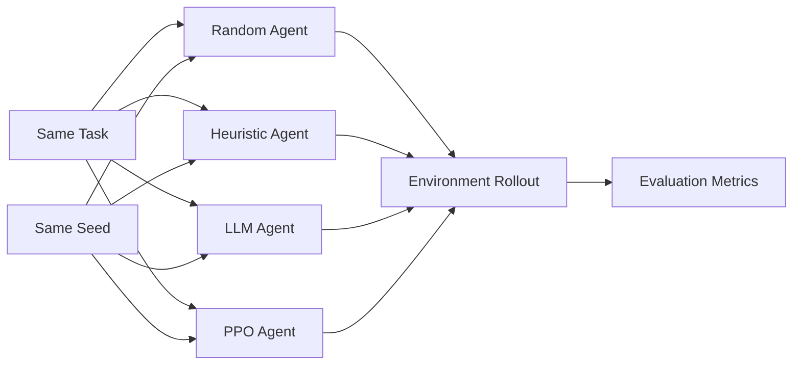

This allows controlled evaluation across different strategy-generation approaches.

---

## Evaluation Metrics

| Metric | Purpose |
|---|---|
| Grader Score | Overall task performance |
| Total Revenue | Cumulative revenue generated |
| Budget Allocation | Distribution of marketing resources |
| CTR | Channel engagement |
| CVR | Conversion efficiency |
| ROI | Marketing efficiency |
| Retention | Customer persistence |
| Brand Score | Long-term brand health |
| Experiment Outcome | Effectiveness of experimentation |
| Action Trajectory | Strategy evolution over time |

---

## Hugging Face Space

The project includes an interactive dashboard designed for visual GTM strategy comparison.

The default web interface is available at:

```text
/web/
```

The dashboard evaluates:

- Trained PPO policy
- Equal-allocation heuristic
- Uniform random agent

All agents can be evaluated using the same task and seed.

---

## Interactive Dashboard

The dashboard visualizes the resulting strategy trajectories using Plotly.

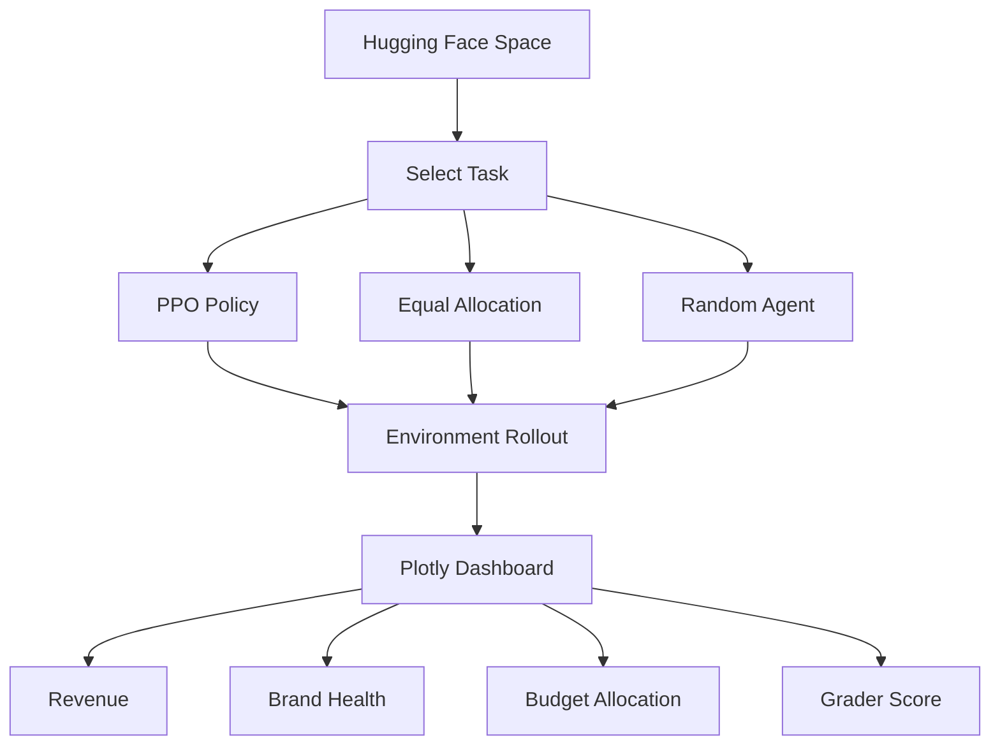

---

## Dashboard Outputs

The interactive dashboard provides visual comparisons of:

- Revenue trajectories
- Brand-health evolution
- Weekly budget allocation
- Agent actions
- Grader scores
- Strategy trajectories

---

## API

The environment exposes a REST API for programmatic interaction.

### API Endpoints

| Endpoint | Method | Description |
|---|---|---|
| `/tasks` | `GET` | List all tasks and action schemas |
| `/baseline` | `POST` | Run a heuristic baseline and return scores |
| `/grader` | `POST` | Calculate the grader score for a task |
| `/infer` | `POST` | Run a trained RL policy |
| `/reset` | `POST` | Reset the environment |
| `/step` | `POST` | Execute one environment step |
| `/state` | `GET` | Retrieve the current environment state |
| `/health` | `GET` | Health check |
| `/ws` | `WS` | Persistent WebSocket environment session |

---

## API Usage

### Run Trained Inference

```bash
curl -X POST http://localhost:7860/infer \
     -H "Content-Type: application/json" \
     -d '{"task_id": "channel_optimizer", "seed": 42}'
```

The endpoint returns a JSON payload containing:

```text
grader_score
total_revenue
weekly_action_trajectory
```

---

## Python Client

The environment can be accessed through the Python client.

```python
from client import GTMEnv
from models import GTMAction

with GTMEnv(base_url="http://localhost:8000").sync() as env:

    result = env.reset(
        task_id="channel_optimizer"
    )

    while not result.done:

        action = GTMAction(

            budget_allocation={
                "paid_search": 0.5,
                "paid_social": 0.3,
                "email_lifecycle": 0.2
            },

            segment_targeting={
                "startup_founders": 0.6,
                "smb_owners": 0.4
            },

            messaging={
                "performance": 0.3,
                "innovation": 0.3,
                "ease_of_use": 0.2,
                "cost_savings": 0.1,
                "reliability": 0.05,
                "security": 0.05
            }
        )

        result = env.step(action)

    print(
        f"Score: {result.observation.reward}"
    )
```

---

## Installation

Clone the repository:

```bash
git clone https://github.com/coder-utkarshchaudhary/gtm-strategy-optimiser.git

cd gtm-strategy-optimiser
```

Install dependencies:

```bash
pip install -r requirements.txt
```

---

## Local Development

Start the local API server:

```bash
uvicorn server.app:app \
    --host 0.0.0.0 \
    --port 8000 \
    --reload
```

The API will be available at:

```text
http://localhost:8000
```

---

## Docker

Build the Docker image:

```bash
docker build \
    -t gtm-optimizer \
    -f server/Dockerfile .
```

Run the container:

```bash
docker run \
    -p 8000:8000 \
    gtm-optimizer
```

---

## Project Structure

```text
gtm-strategy-optimiser/
│
├── client.py
├── models.py
├── baseline.py
├── requirements.txt
│
├── rl/
│   ├── train.py
│   └── infer.py
│
├── checkpoints/
│   ├── channel_optimizer.pt
│   ├── growth_strategist.pt
│   └── market_dominator.pt
│
├── server/
│   ├── app.py
│   └── Dockerfile
│
└── README.md
```

---

## End-to-End Workflow

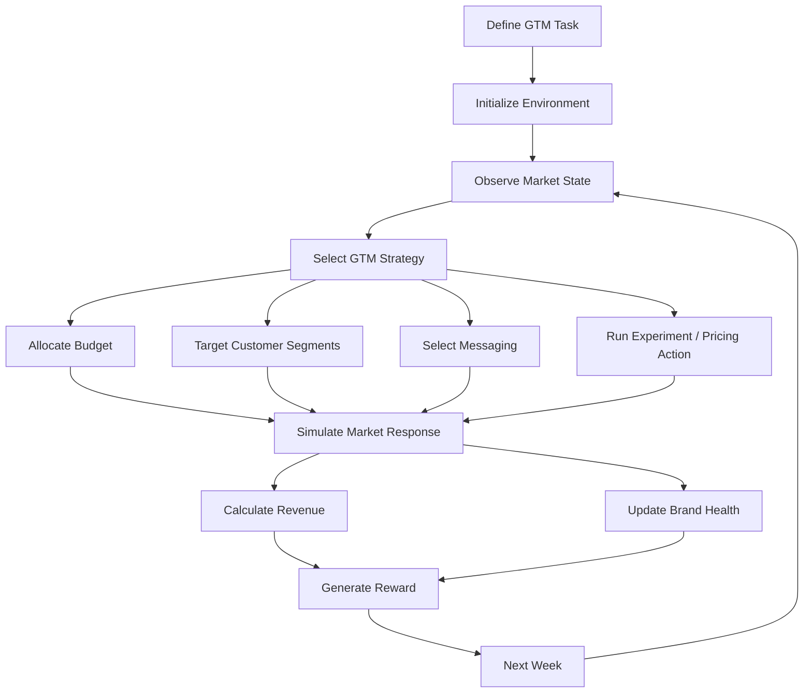

---

## Example GTM Decision

At a particular timestep, an agent may select the following strategy:

```text
Budget Allocation
├── Paid Search       → 50%
├── Paid Social       → 30%
└── Lifecycle Email   → 20%

Customer Targeting
├── Startup Founders  → 60%
└── SMB Owners        → 40%

Messaging
├── Performance       → 30%
├── Innovation        → 30%
├── Ease of Use       → 20%
├── Cost Savings      → 10%
├── Reliability       → 5%
└── Security          → 5%
```

The environment then simulates the resulting market response and produces the next observation.

---

## Strategy Adaptation

The key property of the environment is that the agent does not make a single GTM decision.

Instead, it continuously adapts:

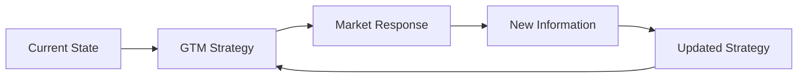

This allows the environment to evaluate whether an agent can adapt its strategy as market conditions evolve.

---

## Key Design Principles

### Sequential Decision-Making

GTM is represented as a sequence of interconnected decisions rather than a single optimization step.

### Multi-Dimensional Strategy

Agents jointly control budget, targeting, messaging, experiments, and pricing.

### Uncertainty

The environment includes noisy observations and stochastic market behavior.

### Delayed Effects

Some strategic decisions influence future outcomes rather than producing immediate results.

### Adaptation

Market conditions can change throughout an episode.

### Competitive Dynamics

The hard task introduces competitor responses to successful strategies.

### Controlled Evaluation

Different agents can be evaluated under identical task and seed conditions.

### Extensibility

The environment can be extended with additional channels, segments, experiments, pricing strategies, and market dynamics.

---

## Research Questions

The environment can be used to investigate several research questions:

- Can reinforcement learning policies improve GTM decision-making over static heuristics?
- How do agents balance immediate revenue with long-term brand health?
- How effectively can agents respond to diminishing marketing returns?
- How do policies adapt to competitor responses?
- How robust are policies under market regime shifts?
- How valuable are experiments for sequential GTM optimization?
- How do LLM-based strategies compare with RL-based strategies?
- Can agents discover reusable GTM strategies across different environments?

---

## Reproducibility

Experiments can be reproduced by fixing the task and random seed.

For example:

```bash
python -m rl.infer \
    --task channel_optimizer
```

API-based evaluation can explicitly specify a seed:

```bash
curl -X POST http://localhost:7860/infer \
     -H "Content-Type: application/json" \
     -d '{
       "task_id": "channel_optimizer",
       "seed": 42
     }'
```

Using the same task and seed allows controlled comparisons between different agent strategies.

---

## Results at a Glance

The current equal-allocation heuristic provides the following approximate reference scores:

| Task | Reference Score |
|---|---:|
| `channel_optimizer` | ~0.51 |
| `growth_strategist` | ~0.33 |
| `market_dominator` | ~0.42 |

These reference scores establish a baseline for evaluating trained RL policies and other strategy-generation approaches.

---

## What the Environment Optimizes

The environment is designed around the interaction between several GTM objectives:

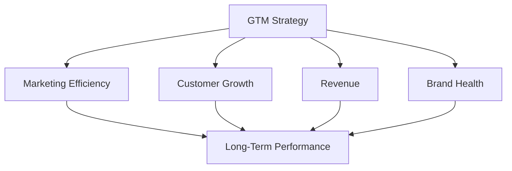

The agent must therefore make decisions while considering both immediate and future consequences.

---

## Core GTM Optimization Loop

The central objective of the environment can be summarized as:

$$
\boxed{
\text{Observe}
\rightarrow
\text{Decide}
\rightarrow
\text{Act}
\rightarrow
\text{Measure}
\rightarrow
\text{Adapt}
}
$$

At each timestep, the agent receives new information about the market and updates its strategy accordingly.

---

## Future Extensions

Potential extensions include:

- Multi-agent competitive GTM
- More sophisticated customer behavior models
- Real-world marketing datasets
- Multi-product GTM optimization
- Portfolio-level marketing budget allocation
- Dynamic pricing models
- Causal experimentation
- Contextual bandit baselines
- Offline reinforcement learning
- Multi-agent reinforcement learning
- LLM-based strategic agents
- Long-horizon brand modeling
- Cross-market GTM transfer learning

---

## License

This project is licensed under the MIT License.

See [`LICENSE`](LICENSE) for details.

---

## Citation

If you use this environment or implementation in your research, experiments, or educational work, please cite:

---

## Contact

**Anjan Mahapatra**

For questions, collaborations, or research discussions, please open an issue in the repository.
